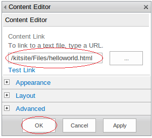

# Installation

The steps below are targeted towards installing the jQuery version of SPUtility on a SharePoint site.

**SharePoint 2013 Note:** SPUtility.js will not work with Minimal Download Strategy (MDS) enabled in SharePoint 2013 (if you see start.aspx it is currently enabled). To disable, go to Site Settings -> Manage Site Features -> Deactivate Minimal Download Strategy.

For more troubleshooting information see [Troubleshooting](Troubleshooting)

## SharePoint 2010 / 2013 / SharePoint Online (Office 365)

**Step 1:** Download [jQuery](http://jquery.com/download/). Version 1.x is recommend for maximum browser compatibility.
**Step 2:** Download [sputility.min.js](https://raw.github.com/kitmenke/sputility/master/dist/sputility.min.js). For development, you can use [sputility.js](https://raw.github.com/kitmenke/sputility/master/dist/sputility.js) instead (uncompressed version for easier debugging).
**Step 3:** Upload both files into a document library in your SharePoint site.
**Step 4:** Create a new HTML file with your SPUtility.js script. For example,  [helloworld.html](https://raw.github.com/kitmenke/sputility/master/examples/helloworld.html) and upload that to your document library as well.
**Step 5:** Navigate to the list form you want to modify. In the ribbon, click on List then Form Web Parts and choose the form you want to edit (ex: New Form, Edit Form).

**Step 6:** Add a Content Editor web part to the page.

**Step 7:** Edit Content Editor's web part properties:
* For Content Link, paste in the URL to your HTML file. Ex: /kitsite/Files/helloworld.html
* Under the Appearance section, you will probably also want to set Chrome Type to None so your end users won't see an empty web part.

**Step 8:** Click the OK button and then click Stop Editing in the ribbon. You're done!

Note: **+Do NOT click the Apply button+**, you must click the OK button!

You should now be able to go back into your form and see "Hello World" populated

## SharePoint 2007

**Step 1-3:** _Steps are the same as above_

**Step 4:** Navigate to form (EditForm.aspx or NewForm.aspx)

You can just create/edit/view any item in the list to get to the right form.

Alternatively, navigate directly to the page using a direct URL. For example: https://example.sharepoint.com/Lists/Test%20List/NewForm.aspx
https://example.sharepoint.com/Lists/Test%20List/EditForm.aspx
https://example.sharepoint.com/Lists/Test%20List/DispForm.aspx

**Step 5:** Edit the page

Click Site Actions -> Edit Page.

If the Edit Page option is missing, use the ToolPaneView=2 URL parameter. For example, https://example.sharepoint.com/Lists/Test%20List/EditForm.aspx?ToolPaneView=2)

**Step 6:** Add a Content Editor Web Part to the page

**Step 7:** Edit the web part. Click Edit -> Modify shared web part

**Step 8:** Edit the content editor's HTML to add some JavaScript. Click Source Editor and paste in your code.  For example, you can paste the contents of [helloworld.html](https://raw.github.com/kitmenke/sputility/master/examples/helloworld.html) into your content editor.

**Step 9:** You're done! Save the page / stop editing.

### Alternative Installation Options

If you don't want to add a content editor to each form, you can also edit the pages using SharePoint Designer and include your scripts that way. This is not recommended unless you are already customizing the page for a different reason.

### Advanced Options for Running SPUtility.js

#### After the whole page has loaded (SharePoint)

You can use a SharePoint JavaScript function to run your code:
{{
function MyCustomExecuteFunction()
{
    // your code here...
}
_spBodyOnLoadFunctionNames.push("MyCustomExecuteFunction");
}}

#### After the whole page has loaded (jQuery)

You can use jQuery to wait until the entire page has loaded:
{{
$(window).load(function () {
    // your code here...
});
}}

#### Before the entire page is loaded, when the DOM is ready (jQuery)

A slightly faster option, is using $(document).ready(..). This executes as soon as the DOM is ready (before the window loads). [http://learn.jquery.com/using-jquery-core/document-ready/](http://learn.jquery.com/using-jquery-core/document-ready/).
{{
$(document).ready(function() {
    // your code here...
});
}}

#### Immediately after your form is loaded

This is the fastest and most advanced method.

If you have a lot of JavaScript code, you may notice the page changing after it loads (as SPUtility works its magic). If you don't want users to see this, you can do the following:
# Move your Content Editor Web Part below the form (it must be **below** the List View Web Part)
# Put your code directly in between the script tags:
{{

}}
This will force your JavaScript to run immediately. If you don't put the Content Editor below the form, the JavaScript will load before the form has loaded and you will get JavaScript errors.